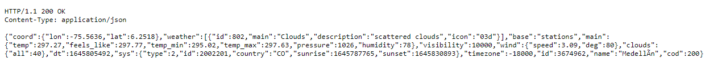

### Parcial AREP 

Esta aplicacion web permite consultar el clima de diferentes
ciudades del mundo. Para consegir esto, la aplicación consume una
API de la página https://openweathermap.org/ 

### Funcionamiento

El despliege está hecho en Heroku y se puede revisar en el siguiente link

https://weather-arep.herokuapp.com/

**Prueba de funcionamiento**

Se ingresa al link de Heroku

Se llena el campo con el nombre de alguna ciudad

Se puede visualizar la respuesta obtenida en formato JSON

